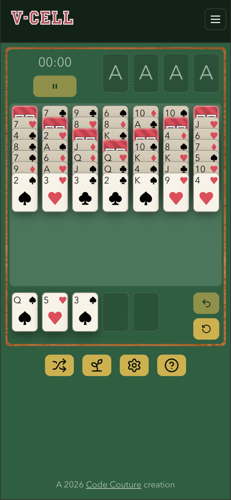

# V-Cell V2

V-Cell V2 is a modern web rebuild of a solitaire-style card game inspired by FreeCell, designed as both a polished player experience and a deliberately engineered frontend system.

This project combines a deterministic TypeScript game engine with a Next.js application layer that handles interaction, animation, persistence, authentication, offline support, and installable PWA behavior.

Live version: [vcell.codecouture.site](https://vcell.codecouture.site)

<!-- screenshot here -->



## Engineering Highlights

- **Custom game engine architecture**  
  The core rules live in a pure TypeScript engine, separated from rendering and input concerns. That keeps game logic deterministic, testable, and reusable.

- **Full keyboard-first interaction model**  
  Gameplay is not mouse-only. The board supports spatial keyboard navigation, carry/drop interactions, undo, pause, restart, auto-moves, and focus restoration.

- **Progressive web app experience**  
  The app registers a service worker, supports installation on mobile devices, and is designed to remain useful in offline or unstable network conditions.

- **Thoughtful persistence model**  
  Local play works without an account, while authenticated users can sync profile and gameplay data through Firebase and Firestore.

- **Real product thinking, not just UI assembly**  
  The project includes guest flows, login/signup, stats views, settings, offline-aware UX, install prompts, theme support, and production deployment configuration.

## Product Highlights

- Playable solitaire variant with rule-aware drag-and-drop and keyboard controls
- Guest mode for frictionless play on a single device
- Google and email/password authentication with Firebase
- Synced stats and profile data for signed-in users
- Local persistence for in-progress sessions and completed games
- Installable PWA flow for mobile home-screen use
- Offline-aware UI with graceful guest fallback
- Theme preferences and reduced-motion support

## Tech Stack

- **Frontend:** Next.js, React, TypeScript, styled-components
- **State management:** Redux Toolkit
- **Backend services:** Firebase Authentication, Firestore, Firebase Admin
- **Persistence:** IndexedDB, localStorage
- **Testing:** Vitest, React Testing Library, Playwright
- **Deployment:** Netlify

## Architecture

The repository is organized as a small monorepo:

- `apps/web`  
  The Next.js application. This layer owns rendering, routing, auth flows, persistence wiring, offline UX, install prompts, and player-facing features.

- `packages/engine`  
  The pure game engine. This package owns rules, legality, move application, and deterministic game behavior.

- `packages/ui`  
  Shared UI primitives, styles, and reusable presentation components.

That split is intentional: game rules remain framework-agnostic, while the application layer is free to evolve around usability, presentation, and product features.

## Notable Engineering Decisions

- **Pure core logic, impure app shell**  
  The engine avoids DOM and framework coupling, making correctness easier to test and reason about.

- **Accessibility through interaction design**  
  Keyboard support is treated as a first-class control system rather than an afterthought.

- **Local-first behavior**  
  Guests can play without creating an account, and the app preserves useful functionality even when connectivity is unavailable.

- **Separation of persistence concerns**  
  Lightweight preferences use `localStorage`, while richer gameplay records and in-progress state use IndexedDB and cloud sync where appropriate.

## Running Locally

### Prerequisites

- Node.js 20.19+  
- npm workspaces enabled via the included root configuration

### Install

```sh
npm install
```

### Start the web app

```sh
npm run web:dev
```

Then open [http://localhost:3000](http://localhost:3000).

### Useful commands

```sh
npm run check
npm run test
npm run build
```

Workspace-specific commands:

```sh
npm run engine:test
npm run web:check
npm run web:build
```

## Environment Notes

The web app expects Firebase configuration for authentication and cloud-backed features. A local `.env` setup is needed for full auth and sync behavior during development.

## Author

Built by [Jude Clark](https://github.com/judeclark19).
